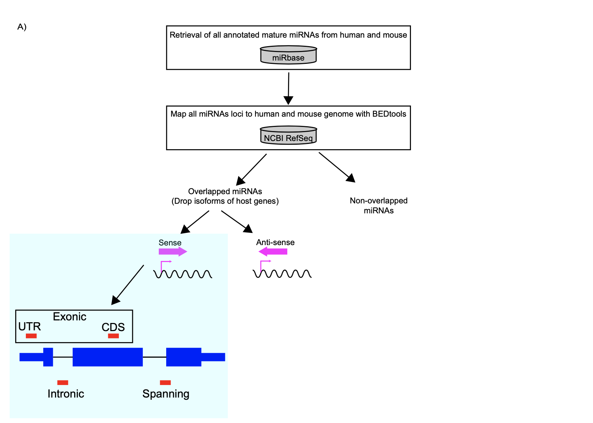

##               Mining exonic miRNAs from human and mouse genome

This script is written by Tyron Chang , the programming languages and tools used for this study are are shown below:
1. Python (data cleaning and processing)
2. BEDTools (overlapping the exonic microRNAs)
3. Shell (use awk and basic command lines to convert tsv files into bed file)

### The pipeline is shown above 

miR loci data are retrieved from [miRbase](https://www.mirbase.org/download/)
The original NCBI RefSeq data are retrieved from [UCSC genome table browser](https://genome.ucsc.edu/cgi-bin/hgTables)

All the data cleaning is carried out with shell and python.

### Data cleaning is done with python file. Here I use OOP to import a series of classes and methods:

*  **`Data.ipynb`** ->this file is used for data cleaning, and it contains a series of methods in a class.

* **`Gene_func.ipynb`**-> this file will assign new column to the dataframe to indicate if the host gene is a protein coding or non-coding gene.

Subsequent characterization of exon-derived miRNAs (GO analysis, heatmap, etc) was carried out with the metadata generated from this pipeline

### More information about the following files:

**Bed files**:

*Human*
1. all exonic miRs=> **`human_exonic_miR_NCBI.bed`**
2. all intronic and no host genes miRs=> **`human_nonoverlapmiR_NCBI.bed`**
3. all intronic miRs=> **`human_intronic_miR_NCBI.bed`**
4. all no host genes miRs=> **`human_miR_no_hostmRNA_NCBI.bed`**

